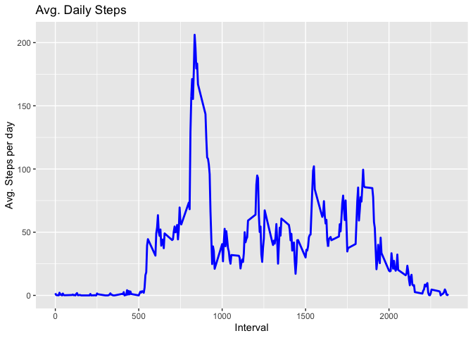

Peer-graded Assignment: Reproducible Research: Peer Assessment 1

2021-09-15 01:15:51 JST

By Yulong Wang

## Repo

1. Valid GitHub URL 

2. At least one commit beyond the original fork

3. Valid SHA-1

4. SHA-1 corresponds to a specific commit

## Commit containing full submission

1. Code for reading in the dataset and/or processing the data

2. Histogram of the total number of steps taken each day

3. Mean and median number of steps taken each day

4. Time series plot of the average number of steps taken

5. The 5-minute interval that, on average, contains the maximum number of steps

6. Code to describe and show a strategy for imputing missing data

7. Histogram of the total number of steps taken each day after missing values are imputed

8. Panel plot comparing the average number of steps taken per 5-minute interval across weekdays and weekends

9. All of the R code needed to reproduce the results (numbers, plots, etc.) in the report


```r
setwd("/Users/yulong/GitHub/RepData_PeerAssessment1")
```

## Loading and preprocessing the data

1. Unzip data to obtain a csv file.

```r
library("data.table")
library(ggplot2)

unzip("activity.zip")
```

2. Reading csv Data into Data.Table.

```r
activityDT <- data.table::fread(input = "activity.csv")
```

## What is mean total number of steps taken per day?

1. Calculate number of setps

```r
Total_Steps <- activityDT[, c(lapply(.SD, sum, na.rm = FALSE)), .SDcols = c("steps"), by = .(date)] 

head(Total_Steps, 10)
```

```
##           date steps
##  1: 2012-10-01    NA
##  2: 2012-10-02   126
##  3: 2012-10-03 11352
##  4: 2012-10-04 12116
##  5: 2012-10-05 13294
##  6: 2012-10-06 15420
##  7: 2012-10-07 11015
##  8: 2012-10-08    NA
##  9: 2012-10-09 12811
## 10: 2012-10-10  9900
```
2. Show a histogram plot of the number of steps.

```r
ggplot(Total_Steps, aes(x = steps)) +
    geom_histogram(fill = "blue", binwidth = 1000) +
    labs(title = "Daily Steps", x = "Steps", y = "Frequency")
```

```
## Warning: Removed 8 rows containing non-finite values (stat_bin).
```

<!-- -->

3. Calculate and report the results.

```r
Total_Steps[, .(Mean_Steps = mean(steps, na.rm = TRUE), Median_Steps = median(steps, na.rm = TRUE))]
```

```
##    Mean_Steps Median_Steps
## 1:   10766.19        10765
```

## What is the average daily activity pattern?

1. Time series plot

```r
IntervalDT <- activityDT[, c(lapply(.SD, mean, na.rm = TRUE)), .SDcols = c("steps"), by = .(interval)] 
ggplot(IntervalDT, aes(x = interval , y = steps)) + geom_line(color="blue", size=1) + labs(title = "Avg. Daily Steps", x = "Interval", y = "Avg. Steps per day")
```

<!-- -->

2. The maximum interval.

```r
IntervalDT[steps == max(steps), .(max_interval = interval)]
```

```
##    max_interval
## 1:          835
```

## Imputing missing values

1. Report the number of missing values.

```r
activityDT[is.na(steps), .N ]
```

```
## [1] 2304
```

```r
# alternative solution
nrow(activityDT[is.na(steps),])
```

```
## [1] 2304
```

2. Filling in missing values with median of dataset.

```r
activityDT[is.na(steps), "steps"] <- activityDT[, c(lapply(.SD, median, na.rm = TRUE)), .SDcols = c("steps")]
```

3. Save as a new dataset with missing values filled.

```r
data.table::fwrite(x = activityDT, file = "tidyData.csv", quote = FALSE)
```

4. Plot histogram.

```r
# total number of steps taken per day
Total_Steps <- activityDT[, c(lapply(.SD, sum)), .SDcols = c("steps"), by = .(date)] 
# mean and median total number of steps taken per day
Total_Steps[, .(Mean_Steps = mean(steps), Median_Steps = median(steps))]
```

```
##    Mean_Steps Median_Steps
## 1:    9354.23        10395
```

```r
ggplot(Total_Steps, aes(x = steps)) + geom_histogram(fill = "blue", binwidth = 1000) + labs(title = "Daily Steps", x = "Steps", y = "Frequency")
```

<!-- -->

## Are there differences in activity patterns between weekdays and weekends?

1. Create a new factor variable in the dataset with two levels – “weekday” and “weekend” indicating whether a given date is a weekday or weekend day.


```r
# Just recreating activityDT from scratch then making the new factor variable. (No need to, just want to be clear on what the entire process is.) 
activityDT <- data.table::fread(input = "activity.csv")
activityDT[, date := as.POSIXct(date, format = "%Y-%m-%d")]
activityDT[, `Day of Week`:= weekdays(x = date)]
activityDT[grepl(pattern = "Monday|Tuesday|Wednesday|Thursday|Friday", x = `Day of Week`), "weekday or weekend"] <- "weekday"
activityDT[grepl(pattern = "Saturday|Sunday", x = `Day of Week`), "weekday or weekend"] <- "weekend"
activityDT[, `weekday or weekend` := as.factor(`weekday or weekend`)]
head(activityDT, 10)
```

```
##     steps       date interval Day of Week weekday or weekend
##  1:    NA 2012-10-01        0      Monday            weekday
##  2:    NA 2012-10-01        5      Monday            weekday
##  3:    NA 2012-10-01       10      Monday            weekday
##  4:    NA 2012-10-01       15      Monday            weekday
##  5:    NA 2012-10-01       20      Monday            weekday
##  6:    NA 2012-10-01       25      Monday            weekday
##  7:    NA 2012-10-01       30      Monday            weekday
##  8:    NA 2012-10-01       35      Monday            weekday
##  9:    NA 2012-10-01       40      Monday            weekday
## 10:    NA 2012-10-01       45      Monday            weekday
```

2. Make a panel plot containing a time series plot (i.e. 𝚝𝚢𝚙𝚎 = "𝚕") of the 5-minute interval (x-axis) and the average number of steps taken, averaged across all weekday days or weekend days (y-axis). See the README file in the GitHub repository to see an example of what this plot should look like using simulated data.


```r
activityDT[is.na(steps), "steps"] <- activityDT[, c(lapply(.SD, median, na.rm = TRUE)), .SDcols = c("steps")]
IntervalDT <- activityDT[, c(lapply(.SD, mean, na.rm = TRUE)), .SDcols = c("steps"), by = .(interval, `weekday or weekend`)] 
ggplot(IntervalDT , aes(x = interval , y = steps, color=`weekday or weekend`)) + geom_line() + labs(title = "Avg. Daily Steps by Weektype", x = "Interval", y = "No. of Steps") + facet_wrap(~`weekday or weekend` , ncol = 1, nrow=2)
```

<!-- -->
